# Be Mindful 

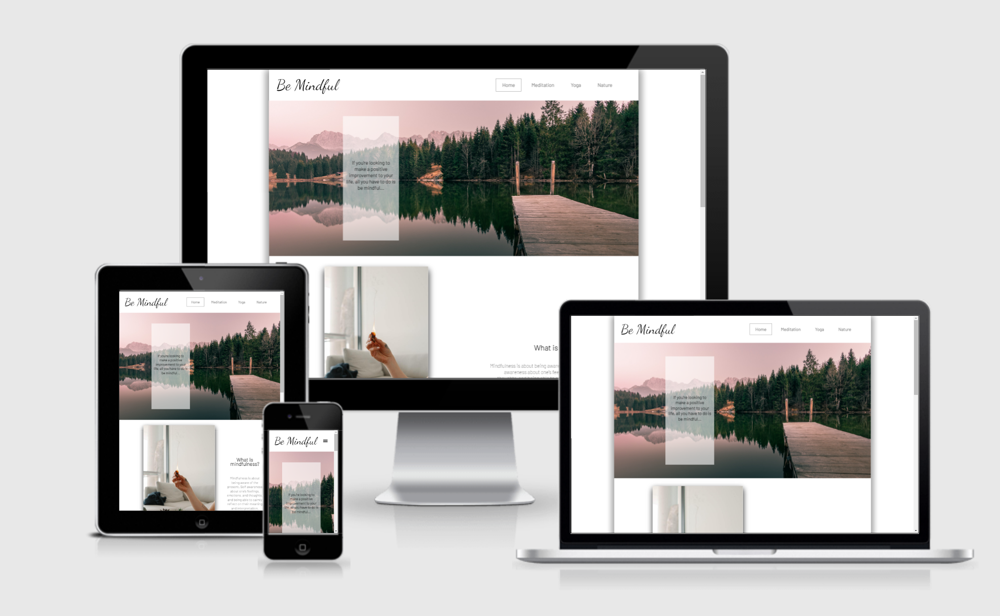

Be Mindful is a mindfulness and meditation website, designed to provide information to the user on how to live a more healthy and positive minded lifestyle through various means. The landing page gives a brief explanation of mindfulness, meditation, and yoga. The meditation page has a 'how to' walkthrough if you are a beginner at the practice and the yoga page goes into detail about the history of the practice, different variations, and links to sites and videos for beginners and intermediates. The site encourages people to get out into nature and signposts where users can find more information. 

## User Experience (UX)

### User Stories           
- First time visitor goals:
  - To be able to find easily accessable information about mindfulness.

  - To find links and/or directions on how to practice meditation and yoga.

  - To easily navigate a website on any device I own.

- Returning visitor goals

  - To easily find my way back to the information I found previously.

  - To be able to share the website with people and have them easily use it without direction from me.

- Frequent user goals

  - To see updates to the website with better information and links.

  - To recieve emails from the site with links to new information/articles/videos etc.

### Design
- Color Scheme
  - Simple, clean, calm, white background with colourful images overlayed to look as though they are floating. 

- Typography
  - An easy to read typeface Barlow is used throughout the site following a calm motif. Dancing Script was used for the logo so that it would stand out against the reast of the site. 

- Imagery
  - Colourful, vibrant images contrasting a white background to elicit calm feelings in the user.

- Wireframes 
  - Home page
    
    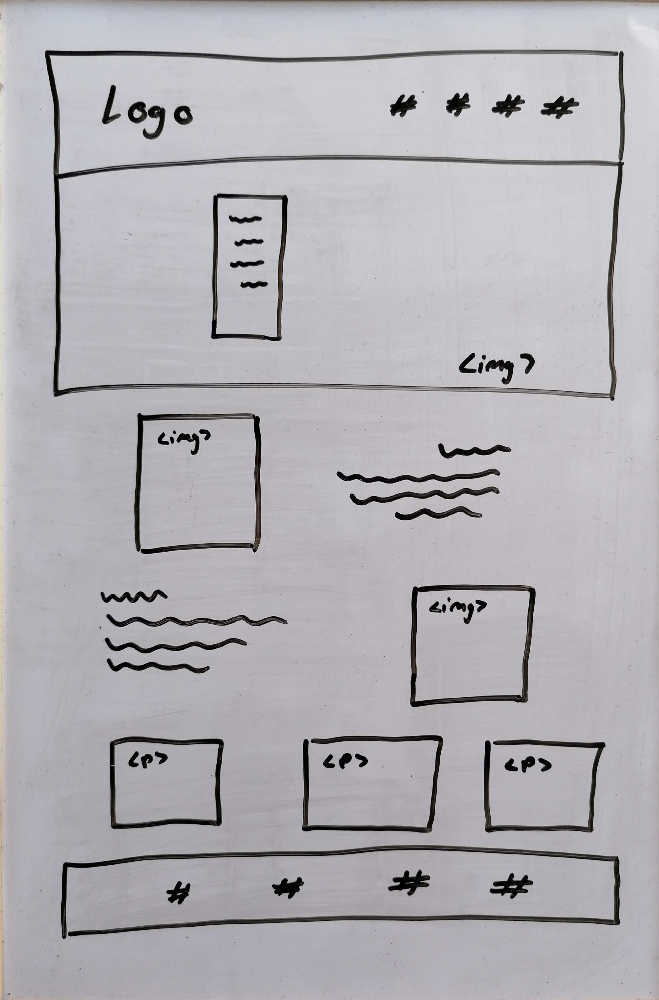
  - Meditation page
    
    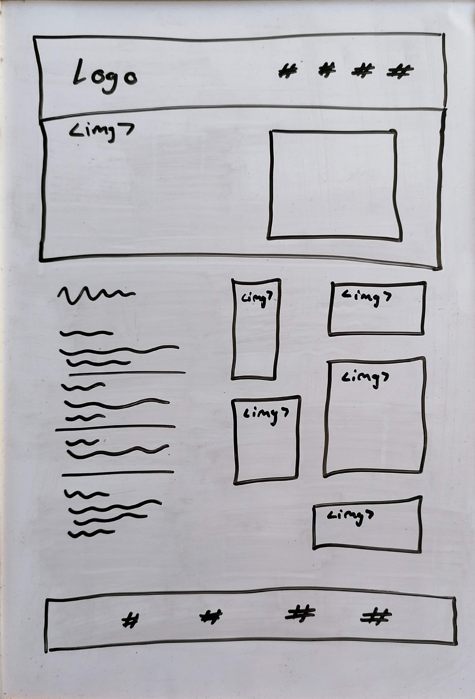
  - Yoga page
    
    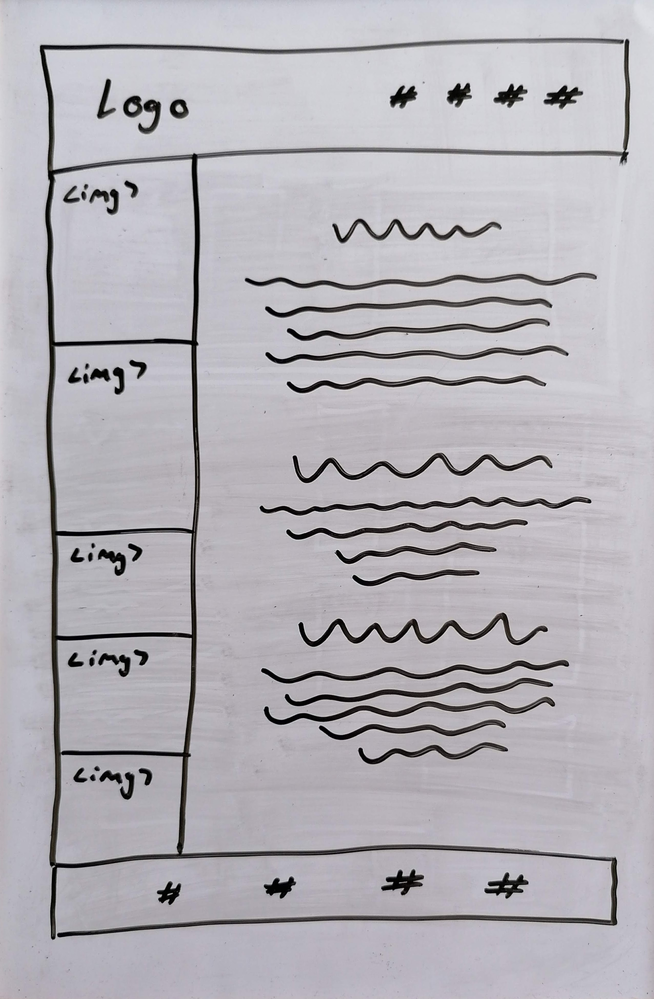
  - Nature page
    
    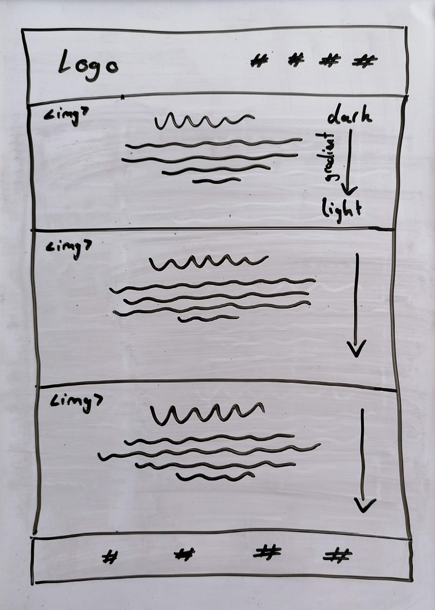

<!-- HTML used instead of markdown to control image size as images were very large when testing. -->

## Features

### Existing features
- Responsive navigation bar
- Interactive elements
- Responsive design for all screen sizes.

### Landing Page

 

 - The landing page loads with a calming image and immediate access to the navigation. The overlay gives the user the reason behind the website and has a smooth hover effect.

 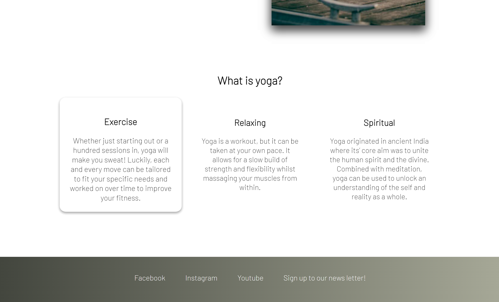

- The bottom of the landing page has interactive cards as the user hovers over them giving a little information regarding yoga to encourage the user to learn more by navigating to the relevant page.
- The footer follows a similar colour scheme to the hero image to tie the page together and give links to social media and access to the news letter sign up page. This is featured on all pages.

 ### Meditation page

 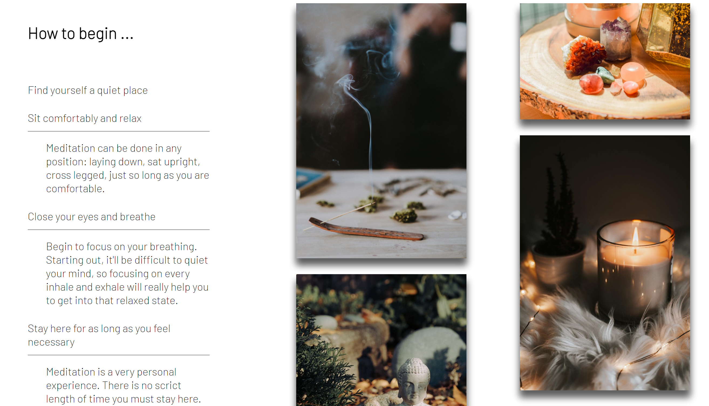

 - The meditation page has a gallery of images to provide context and a step by step guide on how to meditate for beginners. 

 ### Yoga page

 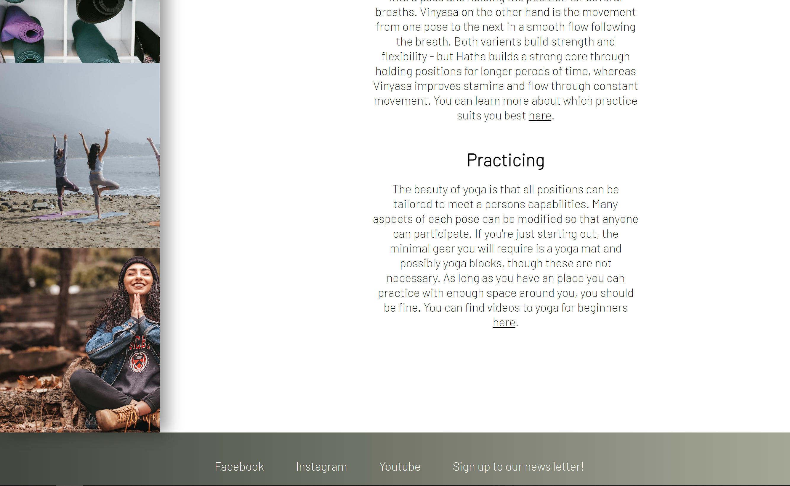

 - The yoga page has various information from history to practicing. Images to the side provide context and follow the design motif of the site. Links found in the text navigate to pages with specific information relevant to the paragraph. 

### Nature page

- The nature page has some basic information with links to external sites where the user can learn more.

### Sign up page

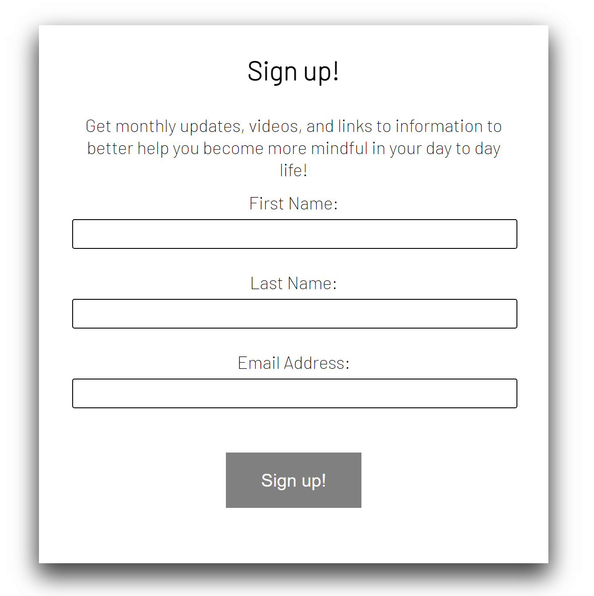

- The sign-up page is for a potential news letter the user could have access to.

## Features to be implimented

- A functioning news letter where users can add their emails and receive periodic emails with new information and links users may find interesting. 

## Languages Used

- HTML5
- CSS3

## Frameworks used

- [Google Fonts](https://fonts.google.com/)
- Git
- GitHub

## Testing

- The original project was constructed on a laptop with a screen size of 12.3 inches. The code was also put through W3C validators and passed through without any issues.

  - [W3C Markup Validator](https://validator.w3.org/#validate_by_input)

  - [W3C CSS Validator](https://jigsaw.w3.org/css-validator/#validate_by_input)

### Known bugs
- On the meditation page, under 720px width, a white band appeared to the right of the screen that pushed all the content over. Although generally hidden on smaller screen, it could be scrolled to. Using [this comment](https://stackoverflow.com/questions/4617872/white-space-showing-up-on-right-side-of-page-when-background-image-should-extend) from Stack Overflow, I added the necessary code into my own to fix the bug.

## Further testing
- The site was tested on Google Chrome using their developer tools and viewed on Firefox and Microsoft Edge to ensure it worked across multiple platforms. The site was also viewed on multiple devices of varying screen sizes.

- Google Chrome's DevTools Lighthouse:
  - Desktop
        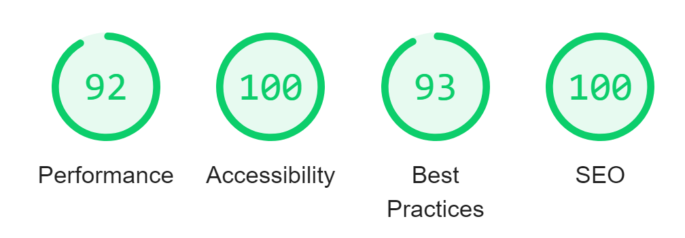
  - Mobile
        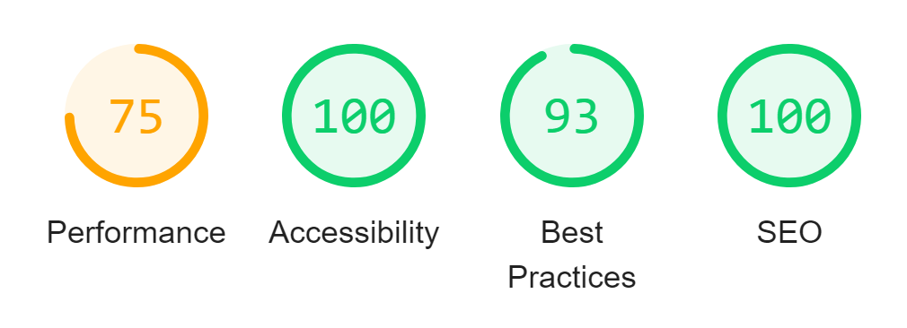

## Deployment 
- The site was deployed to GitHub pages. The steps to deploy are as follows:
  - In the GitHub repository, navigate to the Settings tab
  - From the source section drop-down menu, select the Master Branch
  - Once the master branch has been selected, the page will be automatically refreshed with a detailed ribbon display to indicate the successful deployment.

- You can view the live site [here](Add site link here).

## Credits 

### Content
- Code
  - Code not covered in the lessons leading up to this project were researched and found on [Stack Overflow](https://stackoverflow.com/) and [W3Schools](https://www.w3schools.com/tags/default.asp). Specifically [centering content](https://www.w3schools.com/howto/howto_css_center-vertical.asp), [box-shadow](https://www.w3schools.com/cssref/css3_pr_box-shadow.asp), and [linear gradients](https://www.w3schools.com/css/css3_gradients.asp).

- Content
  - All content was written and researched by the developer.

- Media
  - Images provided are sourced from [Unsplash](https://unsplash.com):

### Artists:

[Aiden Craver](https://unsplash.com/@slaiden)

[Annie Spratt](https://unsplash.com/@anniespratt)

[Anton Sharov](https://unsplash.com/@antonsharov)

[Carson Foreman](https://unsplash.com/@carsonforemanphotos)

[Elena Kloppenburg](https://unsplash.com/@elli19)

[Geran de Klerk](https://unsplash.com/@gerandeklerk)

[Highbabe](https://unsplash.com/@highbabeuk)

[Jordan Nix](https://unsplash.com/@jordannix)

[Joyce G](https://unsplash.com/@joyce_)

[Kaylee Garret](https://unsplash.com/@realkayls)

[Le Minh Phuong](https://unsplash.com/@leeminfu)

[Mario Dobelmann](https://unsplash.com/@mariodobelmann)

[Mathilde Langevin](https://unsplash.com/@mathildelangevin)

[Omid Armin](https://unsplash.com/@omidarmin)

[Ray Kakte](https://unsplash.com/@raykakte)

[Sarah Brown](https://unsplash.com/@sweetpagesco)

[Sarah Penney](https://unsplash.com/@pennywithaney)

### Acknowledgements

- Hamburger menu made with help from [Kevin Powell](https://www.youtube.com/watch?v=8QKOaTYvYUA&ab_channel=KevinPowell).
    
- Tutor support at Code Institute for all their support throught.

- Friends and family for viewing the site and giving feedback.
